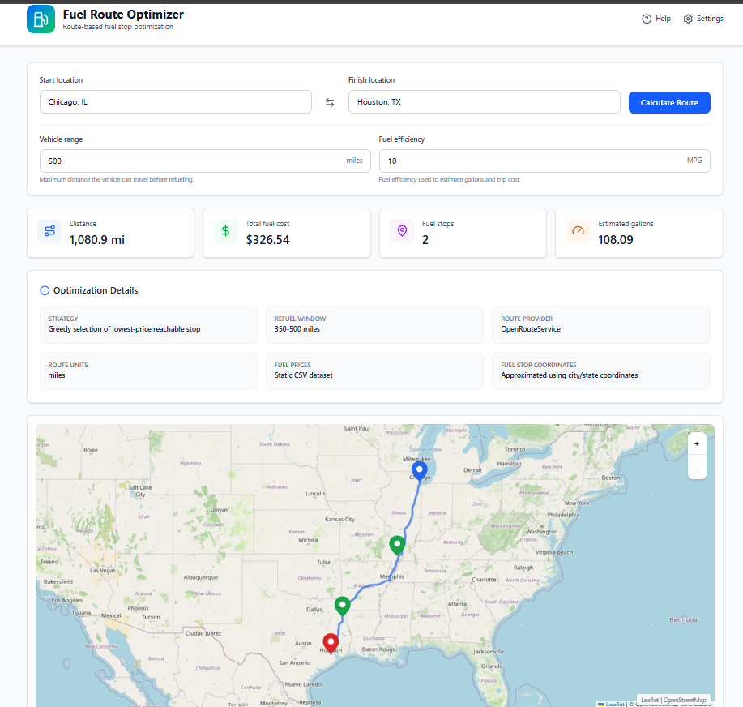
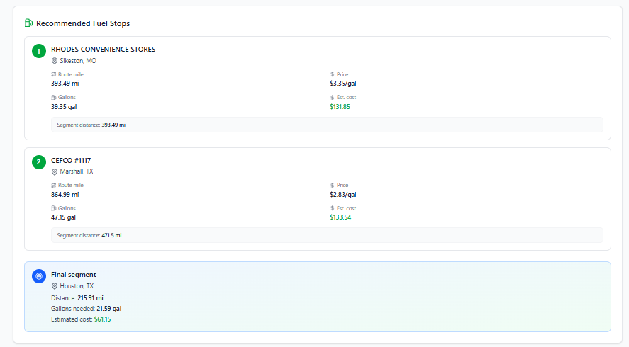

# Fuel Route Optimizer

A fullstack route optimization application that calculates fuel-efficient trip plans for driving routes within the USA.

The app receives a start and finish location, retrieves a real driving route using OpenRouteService, finds nearby fuel stops from a static fuel price dataset, selects cost-effective reachable stops, and estimates the total fuel cost based on configurable vehicle range and fuel efficiency.

The project includes a Django REST Framework backend and a React frontend with route metrics, fuel stop recommendations, optimization details, loading states, error handling, and an interactive Leaflet map.

---

## Features

- Start and finish location input
- Configurable vehicle range
- Configurable fuel efficiency in MPG
- Real route calculation using OpenRouteService
- Fuel price loading from a local CSV dataset
- Local fuel stop enrichment using city/state coordinates
- Nearby fuel stop filtering
- Greedy fuel stop optimization
- Estimated gallons and fuel cost calculation
- GeoJSON route output
- Interactive frontend map with Leaflet
- Recommended fuel stop cards
- Optimization assumptions displayed in the UI
- Loading, empty, and error states
- Backend unit and API tests

---

## Tech Stack

### Backend

- Python
- Django
- Django REST Framework
- OpenRouteService
- geonamescache
- python-dotenv
- requests

### Frontend

- React
- Vite
- TypeScript
- Tailwind CSS
- Axios
- TanStack React Query
- Leaflet
- lucide-react

---

## Architecture

```txt
Frontend
React + Vite + TypeScript
        |
        | POST /api/routes/optimize-fuel/
        |
Backend
Django REST Framework
        |
        | Retrieves route
        |
OpenRouteService API
        |
        | Loads local fuel prices
        |
CSV Fuel Dataset
        |
        | Filters and optimizes stops
        |
JSON Response + GeoJSON Route
        |
Frontend UI + Leaflet Map
```

---

## Main API Endpoint

```txt
POST /api/routes/optimize-fuel/
```

### Request Body

```json
{
  "start": "Chicago, IL",
  "finish": "Houston, TX",
  "vehicle_range_miles": 500,
  "fuel_efficiency_mpg": 10
}
```

### Example Response

```json
{
  "message": "Fuel route optimized successfully.",
  "start": "Chicago, IL",
  "finish": "Houston, TX",
  "distance_miles": 1080.9,
  "vehicle_range_miles": 500,
  "fuel_efficiency_mpg": 10,
  "estimated_gallons_needed": 108.09,
  "total_fuel_cost": 326.54,
  "route_coordinate_count": 1132,
  "nearby_fuel_stops_count": 289,
  "optimal_fuel_stops_count": 2,
  "fuel_stops": [
    {
      "opis_truckstop_id": "123",
      "truckstop_name": "Example Truck Stop",
      "address": "I-40, Exit 123",
      "city": "Example City",
      "state": "MO",
      "rack_id": "456",
      "retail_price": 3.199,
      "latitude": 38.12345,
      "longitude": -92.12345,
      "distance_from_route_miles": 4.32,
      "distance_along_route_miles": 430.25,
      "nearest_route_index": 450,
      "segment_miles": 430.25,
      "gallons_purchased": 43.03,
      "estimated_cost": 137.65
    }
  ],
  "final_segment": {
    "segment_miles": 284.12,
    "gallons_needed": 28.41,
    "price_per_gallon_used": 3.199,
    "estimated_cost": 90.89
  },
  "route_geojson": {
    "type": "LineString",
    "coordinates": []
  },
  "warnings": [],
  "assumptions": {
    "fuel_prices_source": "Static CSV dataset",
    "fuel_stop_coordinates": "Approximated using city/state coordinates",
    "optimization_strategy": "Greedy selection of lowest-price reachable stop",
    "refuel_search_window_miles": "350-500",
    "route_provider": "OpenRouteService",
    "route_units": "miles"
  }
}
```

---

## Health Check Endpoint

```txt
GET /api/routes/health/
```

### Example Response

```json
{
  "status": "ok",
  "service": "fuel-route-optimizer-api"
}
```

---

## How the Optimization Works

The backend retrieves a driving route between the start and finish locations using OpenRouteService.

After the route is retrieved, the application loads the provided fuel price CSV locally. Since the dataset does not include exact latitude and longitude for each truck stop, the app enriches fuel stops using city and state coordinates through a local lookup.

The optimizer then filters fuel stops that are close to the route and estimates their approximate distance along the route.

The selected approach is a greedy optimization strategy:

1. Start at mile 0.
2. Search for fuel stops between 350 miles and the vehicle range from the current position.
3. Select the cheapest fuel stop within that reachable window.
4. Move the current position to that selected fuel stop.
5. Repeat until the destination can be reached within the remaining vehicle range.
6. Calculate gallons and estimated fuel cost for each segment.

This approach recommends cost-effective reachable stops, but it does not guarantee a mathematically global optimum.

---

## Assumptions and Limitations

- The route is limited to driving routes within the USA.
- Fuel prices come from a static CSV dataset.
- Fuel stop coordinates are approximated using city/state coordinates.
- The optimization uses a greedy strategy.
- The algorithm prioritizes low-cost reachable fuel stops within a search window.
- Exact station-level geocoding is not performed for every fuel stop.
- The frontend displays estimates, not guaranteed real-time prices.
- OpenRouteService availability and API limits may affect route calculation.

---

## Project Structure

```txt
fuel-route-optimizer/
├── backend/
│   ├── config/
│   │   ├── settings.py
│   │   └── urls.py
│   ├── data/
│   │   └── fuel-prices-for-be-assessment.csv
│   ├── routes/
│   │   ├── services/
│   │   │   ├── distance_utils.py
│   │   │   ├── fuel_data.py
│   │   │   ├── fuel_optimizer.py
│   │   │   ├── geo_utils.py
│   │   │   └── routing_client.py
│   │   ├── tests/
│   │   │   ├── test_fuel_optimizer.py
│   │   │   └── test_routes_api.py
│   │   ├── serializers.py
│   │   ├── urls.py
│   │   └── views.py
│   ├── manage.py
│   └── requirements.txt
├── frontend/
│   ├── src/
│   │   ├── api/
│   │   ├── app/
│   │   │   ├── components/
│   │   │   ├── hooks/
│   │   │   └── sections/
│   │   ├── config/
│   │   ├── services/
│   │   └── types/
│   ├── package.json
│   └── vite.config.ts
├── .env.example
├── .gitignore
└── README.md
```

---

## Backend Setup

### 1. Clone the repository

```bash
git clone <your-repository-url>
cd fuel-route-optimizer
```

### 2. Create and activate a virtual environment

```bash
python -m venv .venv
```

On Windows PowerShell:

```powershell
.venv\Scripts\Activate.ps1
```

On macOS/Linux:

```bash
source .venv/bin/activate
```

### 3. Install backend dependencies

```bash
cd backend
pip install -r requirements.txt
```

### 4. Configure environment variables

Create a `.env` file in the backend directory or project root, depending on your settings configuration:

```env
OPENROUTESERVICE_API_KEY=your_openrouteservice_api_key
```

You can use `.env.example` as a reference.

### 5. Add the fuel price dataset

Place the provided CSV file inside the backend data directory:

```txt
backend/data/fuel-prices-for-be-assessment.csv
```

The CSV file should include the following columns:

```txt
OPIS Truckstop ID
Truckstop Name
Address
City
State
Rack ID
Retail Price
```

### 6. Run migrations

```bash
python manage.py migrate
```

### 7. Run the backend server

```bash
python manage.py runserver 0.0.0.0:8000
```

The backend API will be available at:

```txt
http://127.0.0.1:8000/api/routes/optimize-fuel/
```

---

## Frontend Setup

Open a second terminal and run:

```bash
cd frontend
npm install
```

Create a `.env` file inside the frontend directory:

```env
VITE_API_BASE_URL=http://127.0.0.1:8000
```

Run the frontend development server:

```bash
npm run dev
```

The frontend will be available at:

```txt
http://localhost:5173/
```

---

## Running Tests

### Backend tests

From the backend directory:

```bash
python manage.py test
```

The current test suite validates:

- Fuel stop selection logic
- Fuel cost calculation
- Custom vehicle range
- Custom fuel efficiency
- No-stop-required routes
- API validation errors
- Routing provider failure handling
- Successful mocked route optimization response
- Health check endpoint

### Frontend build

From the frontend directory:

```bash
npm run build
```

---

## API Testing

You can test the endpoint using Postman, Insomnia, curl, or the Django REST Framework browsable API.

### PowerShell example

```powershell
curl.exe -X POST "http://127.0.0.1:8000/api/routes/optimize-fuel/" `
  -H "Content-Type: application/json" `
  -d "{\"start\":\"Chicago, IL\",\"finish\":\"Houston, TX\",\"vehicle_range_miles\":500,\"fuel_efficiency_mpg\":10}"
```

### macOS/Linux example

```bash
curl -X POST http://127.0.0.1:8000/api/routes/optimize-fuel/ \
  -H "Content-Type: application/json" \
  -d '{"start":"Chicago, IL","finish":"Houston, TX","vehicle_range_miles":500,"fuel_efficiency_mpg":10}'
```

---

## Example Result

For the route:

```txt
Chicago, IL → Houston, TX
```

Using:

```txt
Vehicle range: 500 miles
Fuel efficiency: 10 MPG
```

The application returns approximately:

```txt
Distance: 1,080.9 mi
Fuel stops: 2
Estimated gallons: 108.09
Total fuel cost: $326.54
```

---

## Frontend UI

The frontend displays:

- Search panel for start and finish locations
- Vehicle range and MPG inputs
- Route metrics
- Optimization assumptions
- Interactive Leaflet route map
- Recommended fuel stop cards
- Final segment summary
- Loading state while calculating
- Empty state before route calculation
- Error state for invalid routes or backend/API failures

---

## Screenshots

### Dashboard



### Fuel Stop Recommendations


---

## What I Learned

This project helped me practice building a fullstack application closer to a real production workflow.

Key areas covered:

- Django REST Framework API design
- Service-layer backend architecture
- External API integration
- Local CSV data processing
- Route and distance calculations
- Greedy optimization strategy
- Error handling and validation
- React frontend architecture
- API state management with React Query
- TypeScript interfaces for API responses
- Interactive map rendering with Leaflet
- Frontend loading, empty, and error states
- Automated backend testing
- Clean Git commit history

---

## Future Improvements

- Add route response caching to reduce repeated routing API calls
- Add Docker support
- Improve fuel stop geocoding with exact preprocessed coordinates
- Add frontend tests
- Add CI with GitHub Actions
- Add deployed demo link
- Add screenshots to the README
- Add compact response mode for large GeoJSON outputs
- Add more advanced optimization beyond greedy selection